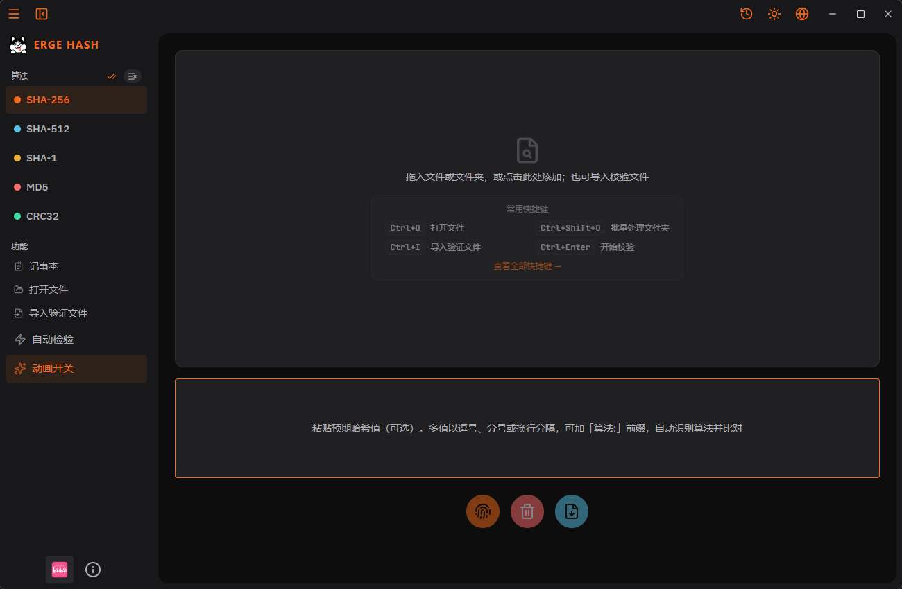

# ErgeHash（二哈）

一款轻量、**跨平台**的桌面**文件哈希校验工具**。核心理念：**本地优先、零上传、极速批量校验、清晰可溯的结果呈现**。

[](https://space.bilibili.com/67221461)
[](https://github.com/ErgeAIA/ErgeHash)
[](./LICENSE)
[](https://github.com/ErgeAIA/ErgeHash/releases)
[](https://github.com/ErgeAIA/ErgeHash/releases)
[](https://tauri.app)
[](https://react.dev)
[](https://www.typescriptlang.org)
[](https://www.rust-lang.org)
[](https://pnpm.io)

[English README](./README.en.md)




## 核心功能

- **多算法哈希计算**：支持 SHA-256、SHA-1、MD5、CRC32 等主流算法，可同时计算多个算法。
- **批量校验**：支持多文件、文件夹递归批量计算；后端对同一文件**单趟读取**即算出所有选中算法，避免重复 IO。
- **拖放即算**：将文件或文件夹直接拖入窗口即可开始计算（基于 Tauri 原生拖放）。
- **校验文件导入与比对**：导入 `.md5` / `.sfv` / `.sha256` 等标准校验文件，自动按文件名分组并逐条比对，直观显示通过 / 失败。
- **结果可溯**：树形文件列表呈现「算法 / 哈希值 / 耗时」，支持单项复制、结果导出为 CSV。
- **跨平台**：基于 Tauri 2，提供 Windows 与 macOS（Apple Silicon）原生体验，代码层无平台硬依赖。
- **主题与国际化**：内置明暗主题，支持中文 / 英文界面切换。
- **本地优先**：所有计算在本地完成，文件绝不上传，无 telemetry。

## 下载

最新版本：**v0.9.96**。所有发行包由 GitHub Actions 在三平台（Windows / macOS / Linux）自动构建，可在 [Releases](https://github.com/ErgeAIA/ErgeHash/releases) 页面下载。

| 平台    | 类型                       | 文件                                    |
| ------- | -------------------------- | --------------------------------------- |
| Windows | NSIS 安装程序（推荐个人）   | `ErgeHash_0.9.96_x64-setup.exe`         |
| Windows | MSI 安装程序（推荐企业部署）| `ErgeHash_0.9.96_x64_en-US.msi`         |
| macOS   | DMG（Apple Silicon）       | `ErgeHash_0.9.96_aarch64.dmg`           |
| macOS   | `.app` 压缩包              | `ErgeHash_aarch64.app.tar.gz`           |
| Linux   | RPM（Fedora / openSUSE 等）| `ErgeHash-0.9.96-1.x86_64.rpm`          |
| Linux   | DEB（Debian / Ubuntu 等）  | `ErgeHash_0.9.96_amd64.deb`             |
| Linux   | AppImage（通用）           | `ErgeHash_0.9.96_amd64.AppImage`        |
| 源码    | Source code (zip / tar.gz) | 见 Release 页面底部                     |

### macOS 平台说明

- 当前 CI 仅在 **Apple Silicon（aarch64）** 上构建，Intel Mac 暂未提供原生包。
- 由于未启用 macOS 代码签名（免费软件策略），首次打开请 **右键 → 打开** 以绕过 Gatekeeper 提示。后续若配置 Apple Developer ID 将进行签名与公证。

## 技术栈

| 层级     | 技术                                    | 版本约束              |
| -------- | --------------------------------------- | --------------------- |
| 桌面框架 | Tauri 2                                 | = 2.11.0              |
| 前端     | React 19 + TypeScript                   | React ^19, TS ~5.8    |
| 构建     | Vite 7                                  | ^7.0                  |
| 状态管理 | Zustand 5                               | ^5.0                  |
| 样式     | Tailwind CSS 4 + CSS 变量主题           | ^4.3                  |
| 国际化   | i18next + react-i18next                 | i18next ^26           |
| 图标     | lucide-react                            | ^1.16                 |
| 哈希算法 | sha2 / md-5 / sha1 / crc32fast (Rust)   | 0.10 / 0.10 / 0.10 / 1 |
| 文件遍历 | walkdir + csv (Rust)                    | 2 / 1                 |
| 后端语言 | Rust                                    | edition 2021          |
| 包管理器 | pnpm                                    | >= 8                  |

## 使用指南

### 基本流程

1. **添加文件**：点击「打开文件」/「打开文件夹」，或直接把文件拖入窗口。
2. **选择算法**：在左侧算法组勾选需要计算的哈希算法（可多选）。
3. **查看结果**：右侧列表展示每个文件的算法、哈希值、耗时；点击哈希值可复制。
4. **导入校验文件**：点击「导入验证文件」选择 `.md5` / `.sfv` 等，程序自动按文件名比对并标记通过 / 失败。
5. **导出结果**：在结果区将当前计算结果导出为 CSV。

### 快捷键

> 快捷键全局生效；macOS 下 `Ctrl` 显示为 `⌘`、`Alt` 显示为 `⌥`、`Shift` 显示为 `⇧`。

| 功能                  | 快捷键                     |
| --------------------- | -------------------------- |
| 打开文件              | `Ctrl + O`                 |
| 打开文件夹            | `Ctrl + Shift + O`         |
| 导入校验文件          | `Ctrl + I`                 |
| 开始校验              | `Ctrl + Enter`             |
| 复制选中哈希          | `Ctrl + Alt + C`           |
| 导出结果（CSV）       | `Ctrl + E`                 |
| 查看历史              | `Ctrl + H`                 |
| 清空历史              | `Ctrl + Alt + H`           |
| 清空文件列表          | `Ctrl + Shift + Backspace` |
| 切换主题              | `Ctrl + Alt + T`           |
| 切换语言              | `Ctrl + Alt + L`           |
| 折叠 / 展开侧栏       | `Ctrl + B`                 |
| 打开设置              | `Ctrl + ,`                 |
| 快速指南              | `Ctrl + /`                 |
| 退出                  | `Ctrl + Q`                 |

## 从源码构建

### 前置条件

- Node.js 18+
- Rust（stable，建议 1.77+）
- pnpm 8+

### 构建

```bash
# 安装前端依赖
pnpm install

# 开发模式（热重载）
pnpm tauri dev

# 生产构建（编译前端 + Rust，产出安装包）
pnpm tauri build
```

### 前端检查

```bash
# 类型检查 + 前端构建
pnpm run build
```

## 作者信息

<table>
<tr>
<td align="center" valign="middle" width="180">
<br>
<b>宝藏二哥AIA / ErgeAIA</b><br>
<sub>生命不息，折腾不止</sub>
</td>
<td valign="middle" style="padding-left: 18px;">

**关于我**：独立开发者 / 全栈工程师 / ComfyUI 爱好者 / Vibe Coding 实践者<br>
**技术栈**：Tauri · Rust · React · Python · Claude · ZCode · Workbuddy<br>
**理念**：三无分享 — 无门槛、无套路、无保留

**链接**：
📺 [B 站](https://space.bilibili.com/67221461) · [知乎](https://www.zhihu.com/people/meli55a/posts) · 微信公众号(ErgeAIA)<br>
🐙 [GitHub](https://github.com/ErgeAIA) · [Gitee](https://gitee.com/ErgeAIA)<br>
📦 精选项目：[ErgeMD](https://github.com/ErgeAIA/ErgeMD) · [ErgeHash](https://github.com/ErgeAIA/ErgeHash) · [catapult-cn](https://github.com/ErgeAIA/catapult-cn)

</td>
</tr>
</table>

---

<div align="center">
如果 ErgeHash 帮到了你，欢迎点个 Star 鼓励一下！
</div>

## 许可证

本项目基于 [Apache License 2.0](./LICENSE) 开源。
